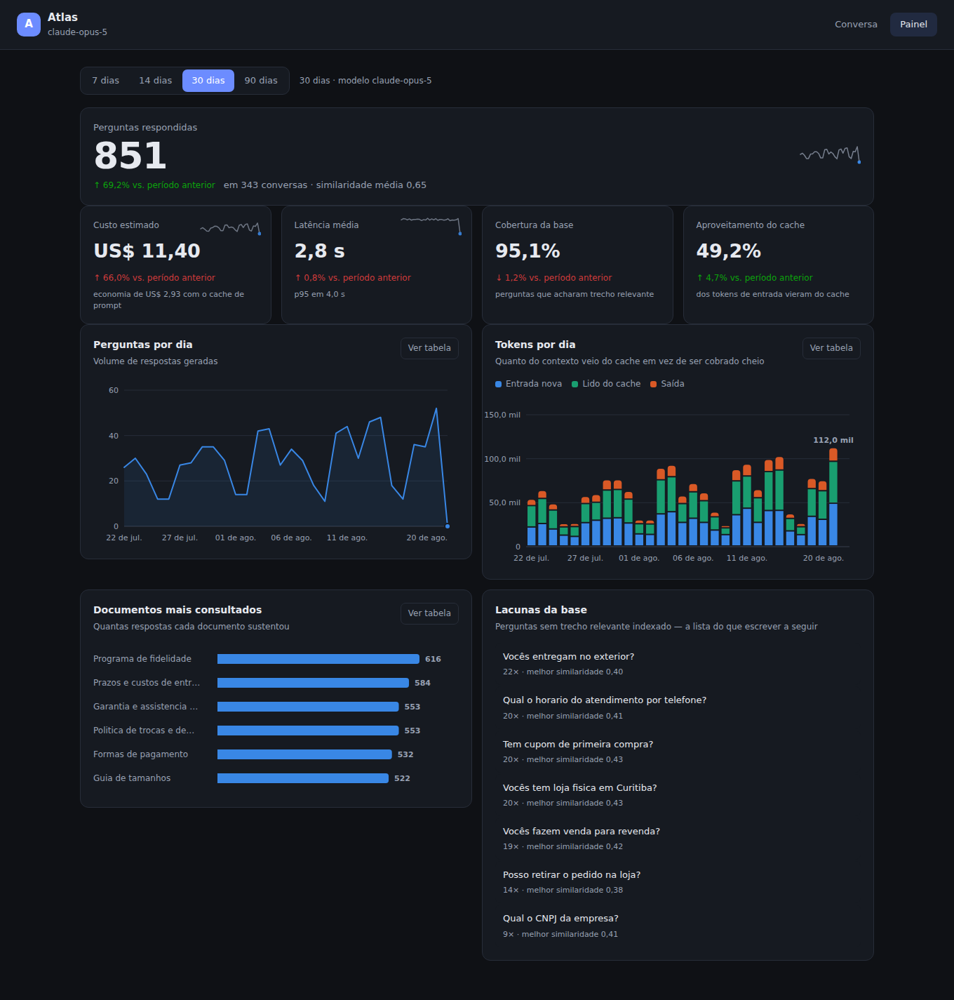

# Atlas IA

Assistente de IA com **RAG** (Retrieval-Augmented Generation): ele responde perguntas
usando a **sua** base de conhecimento, com streaming em tempo real e citando de onde
tirou cada informação.

```
Navegador ──▶ Cloudflare Worker ──▶ Workers AI  (transforma a pergunta em vetor)
                     │             ──▶ Supabase   (busca os trechos mais parecidos)
                     │             ──▶ Claude     (escreve a resposta, em streaming)
                     └──▶ Supabase  (grava a conversa)
```

| Peça | Tecnologia | Papel |
|---|---|---|
| Backend | Cloudflare Workers + Hono | API e serve o front-end |
| Modelo | Claude Opus 5 (API Anthropic) | Gera as respostas |
| Embeddings | Workers AI `@cf/baai/bge-m3` | Vetores multilíngues, 1024 dimensões |
| Banco | Supabase (Postgres + pgvector) | Base de conhecimento, histórico, auth |
| Front-end | HTML/CSS/JS puro | Chat com streaming e painel, sem build |
| Gráficos | SVG escrito à mão | Sem biblioteca, sem CDN, ~14 KB |

> A Anthropic não oferece API de embeddings — por isso os vetores vêm da Workers AI.
> O `bge-m3` foi escolhido por ser multilíngue: a maioria dos modelos abertos de
> embedding é treinada só em inglês e vai mal com português.

O projeto tem duas telas: **Conversa** (o chat) e **Painel** (analytics).

---

## O painel



Todo dado do painel é subproduto do próprio uso — nada é instrumentado à parte.
Cada resposta grava tokens, latência e a similaridade do melhor trecho
recuperado, e é disso que saem os números.

**O que ele responde:**

| Indicador | Para que serve |
|---|---|
| Perguntas respondidas | Volume, com variação sobre o período anterior |
| Custo estimado | Tokens × preço do modelo, mais quanto o cache economizou |
| Latência média e p95 | A média engana; o p95 mostra a experiência do pior caso |
| Cobertura da base | % das perguntas que acharam trecho relevante |
| Aproveitamento do cache | % dos tokens de entrada que vieram do cache |
| **Lacunas da base** | Perguntas que a base não soube responder, agrupadas por repetição |

As **lacunas** são o indicador mais acionável: é a lista, ordenada por
frequência, do conteúdo que falta indexar. Uma dúvida repetida 22 vezes é um
sinal muito mais forte do que 22 dúvidas diferentes aparecendo uma vez cada.

**Como os números são calculados.** As somas acontecem no Postgres, em quatro
funções (`analytics_daily`, `analytics_summary`, `analytics_top_documents`,
`analytics_knowledge_gaps`). O Worker recebe dezenas de linhas já agregadas em
vez de puxar milhares de mensagens para contar em JavaScript — o painel continua
rápido conforme o histórico cresce. O preço por token fica em `src/lib/pricing.ts`,
isolado: quando a tabela da Anthropic mudar, muda-se um arquivo só.

### Dados para apresentar

Painel vazio não demonstra nada. Rode `supabase/demo-data.sql` no SQL Editor e
ele gera 60 dias de histórico realista — volume crescente, fim de semana mais
fraco, cache aquecendo ao longo das conversas e ~14% de perguntas fora do que a
base cobre. Para limpar depois:

```sql
delete from public.conversations where title like '[demo]%';
delete from public.documents where metadata ->> 'origem' = 'demo';
```

### Decisões de visualização

Os gráficos seguem regras, não gosto:

- **A paleta foi validada, não escolhida no olho.** As três cores de série
  passam nos testes de separação para daltonismo (ΔE ≥ 8 em deuteranopia) e de
  contraste contra a superfície real dos cartões, nos dois temas. No tema claro
  o verde fica em 2,82:1 — abaixo de 3:1 — e por isso a legenda e a tabela são
  obrigatórias ali, não opcionais.
- **Nada depende só de cor.** Toda série tem legenda; toda variação vem com
  seta e com o texto "vs. período anterior"; todo gráfico tem um botão
  *Ver tabela* com os mesmos números.
- **Uma figura principal por tela.** "Perguntas respondidas" lidera; o resto são
  cartões-indicadores. Oito cores quando a história é um número só é o jeito
  mais comum de um gráfico errar o alvo.
- **Rótulo direto só onde importa** — a ponta da linha, o dia de maior volume.
  Número em cada ponto vira ruído e ninguém lê.
- **Uma linha de filtros, acima de tudo.** O seletor de período vale para o
  painel inteiro; filtro dentro de cartão faz cada gráfico contar uma história
  de um recorte diferente.
- **Sem eixo duplo.** Nunca duas escalas verticais no mesmo gráfico: o
  alinhamento entre elas é arbitrário e inventa correlação que não existe.
- **A quantidade de datas no eixo sai da largura disponível**, não de um número
  fixo — seis no desktop, três no celular. Data sobreposta não fica apertada,
  fica ilegível.

---

## Como funciona o RAG, em 6 passos

1. Você adiciona um texto pela interface (ou `POST /api/documents`).
2. O Worker **quebra o texto em pedaços** de ~1200 caracteres, com sobreposição
   (`src/lib/chunk.ts`), para nenhuma ideia ser cortada ao meio.
3. Cada pedaço vira um **vetor de 1024 números** via Workers AI e é gravado no
   Postgres na coluna `vector(1024)`.
4. Quando alguém pergunta algo, a pergunta também vira vetor e o Postgres devolve
   os pedaços mais próximos (função `match_document_chunks`, índice HNSW).
5. Esses pedaços entram no prompt do Claude dentro de `<contexto>`, com a instrução
   explícita de **não inventar** o que não estiver ali.
6. A resposta volta em streaming (SSE) e é gravada no histórico junto com as fontes.

---

## Configuração

### 1. Supabase

1. Crie um projeto em [supabase.com](https://supabase.com).
2. Abra **SQL Editor**, cole o conteúdo de `supabase/schema.sql` e rode.
   Isso cria as tabelas, o índice vetorial, a função de busca e as políticas de RLS.
3. Em **Settings → API**, copie:
   - **Project URL** → `SUPABASE_URL`
   - **anon public** → `SUPABASE_ANON_KEY`
   - **service_role** → `SUPABASE_SERVICE_ROLE_KEY` (é um segredo: nunca no front-end)

### 2. Cloudflare

```bash
npm install
npx wrangler login
```

Edite `wrangler.toml` e preencha em `[vars]`:

```toml
SUPABASE_URL = "https://xxxxxxxx.supabase.co"
SUPABASE_ANON_KEY = "eyJhbGciOi..."
```

Grave os segredos (não vão para o `wrangler.toml`):

```bash
npx wrangler secret put ANTHROPIC_API_KEY
npx wrangler secret put SUPABASE_SERVICE_ROLE_KEY
```

A chave da Anthropic sai do [Console](https://console.anthropic.com/settings/keys).

### 3. Rodar

```bash
cp .dev.vars.example .dev.vars   # preencha as duas chaves para o modo local
npm run dev                      # http://localhost:8787
```

> O binding de Workers AI só funciona conectado à Cloudflare — por isso o
> `wrangler login` é necessário mesmo em desenvolvimento.

Deploy:

```bash
npm run deploy
```

Se faltar alguma variável, `GET /api/health` lista exatamente o que está faltando,
e a interface mostra um aviso em vez de falhar com erro genérico.

---

## Usando

1. Abra a aplicação e clique em **+ Adicionar conteúdo**.
2. Cole um texto (política de trocas, manual, FAQ, documentação…) e salve.
   O Worker indexa na hora.
3. Pergunte algo. A resposta vem em streaming, com as fontes usadas logo acima.

---

## API

Todas as rotas ficam sob `/api`. O header `Authorization: Bearer <token do Supabase>`
é opcional enquanto `REQUIRE_AUTH=false`.

| Método | Rota | O que faz |
|---|---|---|
| `GET` | `/api/health` | Status e diagnóstico de configuração |
| `GET` | `/api/analytics?dias=30` | Tudo que o painel precisa, em uma requisição (7/14/30/90) |
| `POST` | `/api/chat` | Conversa (resposta em SSE) |
| `POST` | `/api/search` | Busca semântica pura, sem passar pelo modelo |
| `GET` | `/api/documents` | Lista a base de conhecimento |
| `POST` | `/api/documents` | Indexa um novo texto |
| `DELETE` | `/api/documents/:id` | Remove um documento e seus trechos |
| `GET` | `/api/conversations` | Lista conversas |
| `GET` | `/api/conversations/:id` | Histórico completo de uma conversa |
| `DELETE` | `/api/conversations/:id` | Apaga uma conversa |

### `POST /api/chat`

```bash
curl -N http://localhost:8787/api/chat \
  -H 'Content-Type: application/json' \
  -d '{"message": "Qual o prazo para troca?", "conversationId": null}'
```

Resposta em Server-Sent Events:

| Evento | Conteúdo |
|---|---|
| `meta` | `{ conversationId }` — guarde para continuar a conversa |
| `sources` | trechos usados, com título, similaridade e trecho |
| `thinking` | resumo do raciocínio do modelo (quando houver) |
| `delta` | `{ text }` — pedaços da resposta, conforme são gerados |
| `done` | `{ stopReason, model, usage }` |
| `error` | `{ message }` |

### `POST /api/documents`

```bash
curl http://localhost:8787/api/documents \
  -H 'Content-Type: application/json' \
  -d '{
    "title": "Política de trocas",
    "content": "Aceitamos trocas em até 30 dias corridos...",
    "sourceUrl": "https://minhaloja.com/trocas"
  }'
```

---

## Ajustes

Tudo em `[vars]` no `wrangler.toml`:

| Variável | Padrão | Para quê |
|---|---|---|
| `CLAUDE_MODEL` | `claude-opus-5` | Modelo usado |
| `CLAUDE_EFFORT` | `low` | Profundidade de raciocínio: `low` a `max`. Chat quer latência; análises pedem `high` |
| `EMBEDDING_MODEL` | `@cf/baai/bge-m3` | Trocar exige mudar `vector(N)` no `schema.sql` |
| `RAG_TOP_K` | `6` | Quantos trechos entram no prompt |
| `RAG_MIN_SIMILARITY` | `0.25` | Corte de relevância. Suba se vier lixo, desça se vier pouco |
| `HISTORY_TURNS` | `10` | Quantas trocas anteriores o modelo enxerga |
| `ASSISTANT_NAME` | `Atlas` | Nome exibido |
| `ASSISTANT_PERSONA` | — | Frase que define o tom das respostas |
| `REQUIRE_AUTH` | `false` | `true` exige login do Supabase em toda rota |
| `ALLOWED_ORIGINS` | `*` | Domínios liberados no CORS |

### Autenticação

Com `REQUIRE_AUTH=false` qualquer pessoa usa a API — bom para testar, ruim para
produção, porque **gasta os seus tokens da Anthropic**. Para produção:

1. Ative um provedor em **Authentication** no Supabase.
2. Mude `REQUIRE_AUTH` para `"true"`.
3. No front-end, use `supabase.auth` e mande o `access_token` no header
   `Authorization: Bearer …`.

Com autenticação ligada, cada usuário só enxerga suas conversas e seus documentos;
documentos com `owner_id` nulo continuam públicos para todos.

---

## Decisões de projeto

**Rate limiting ligado por padrão.** 30 requisições por minuto por IP
(`[[ratelimits]]` no `wrangler.toml`). Sem isso, uma chave da Anthropic exposta
numa API aberta vira prejuízo rápido.

**Cache de prompt.** A parte fixa do system prompt vai num bloco com
`cache_control: ephemeral` e **antes** de qualquer coisa que muda a cada requisição.
O cache da Anthropic é por prefixo — um byte diferente no começo invalida tudo
depois dele. Da segunda pergunta em diante, esse trecho custa ~10%.

**`fallbacks: "default"`.** Se os classificadores de segurança recusarem a
requisição, a Anthropic reexecuta em outro modelo no servidor em vez de devolver
uma recusa. A resposta com `stop_reason: "refusal"` chega como HTTP 200, então o
código checa isso antes de ler o conteúdo.

**A pergunta é gravada antes da resposta.** Se o streaming cair no meio, a
pergunta do usuário não se perde.

**Perguntas curtas herdam contexto.** "E o prazo?" sozinha não recupera nada na
busca vetorial. `buildSearchQuery` concatena as últimas falas do usuário para
formar o vetor de busca — sem custar uma chamada extra ao modelo.

**Conteúdo recuperado é dado, não instrução.** Os trechos entram entre tags
`<contexto>` e o system prompt manda tratá-los como dados. É a defesa contra
injeção de prompt via documento indexado.

**`service_role` só no servidor.** O Worker ignora o RLS e filtra por `owner_id`
no código. As políticas de RLS continuam ativas para proteger quem acessar o
Supabase direto do navegador com a chave anon.

---

## Estrutura

```
atlas-ia/
├── src/
│   ├── index.ts              rotas, CORS, rate limit, tratamento de erro
│   ├── env.ts                tipos das variáveis e bindings
│   ├── lib/
│   │   ├── anthropic.ts      cliente Claude, system prompt, cache, fallbacks
│   │   ├── rag.ts            busca vetorial e montagem do contexto
│   │   ├── embeddings.ts     Workers AI
│   │   ├── chunk.ts          divisão do texto em pedaços
│   │   ├── supabase.ts       clientes service_role e anon
│   │   ├── auth.ts           validação do token do Supabase
│   │   ├── pricing.ts        tabela de preços por token
│   │   ├── config.ts         diagnóstico de variáveis faltando
│   │   └── http.ts           erros HTTP e validação de entrada
│   └── routes/
│       ├── chat.ts           conversa com streaming SSE
│       ├── documents.ts      indexação da base de conhecimento
│       ├── conversations.ts  histórico
│       ├── search.ts         busca semântica
│       └── analytics.ts      agregações do painel
├── public/
│   ├── index.html            tela de conversa
│   ├── dashboard.html        tela do painel
│   ├── charts.js             gráficos em SVG, sem biblioteca
│   ├── dashboard.js          monta o painel a partir de /api/analytics
│   └── styles.css            tokens de tema e de visualização
├── supabase/
│   ├── schema.sql            tabelas, índice HNSW, busca, RLS, analytics
│   └── demo-data.sql         60 dias de histórico para demonstração
└── wrangler.toml
```

---

## Próximos passos possíveis

- **Upload de PDF**: extrair o texto no navegador e mandar para `POST /api/documents`.
- **Ferramentas (tool use)**: deixar o Claude decidir quando buscar, em vez de
  sempre buscar antes. Bom para perguntas que não precisam da base.
- **Busca híbrida**: combinar o vetor com busca textual (`tsvector` do Postgres)
  para acertar em nomes próprios e códigos de produto, onde embeddings erram.
- **Reranking**: pegar 20 trechos e reordenar com um modelo menor antes de mandar 6.
- **Custo**: `messages.usage` já é gravado em cada mensagem — dá para montar um
  painel de consumo por usuário direto do Supabase.

## Custo aproximado

- **Claude Opus 5**: US$ 5 por milhão de tokens de entrada, US$ 25 de saída.
  Com cache de prompt, a parte fixa cai para ~10% disso.
- **Workers AI**: os embeddings entram na cota gratuita diária para volumes baixos.
- **Supabase / Workers**: os planos gratuitos cobrem bem um protótipo.

Confira os preços atuais em [anthropic.com/pricing](https://www.anthropic.com/pricing)
antes de dimensionar.
