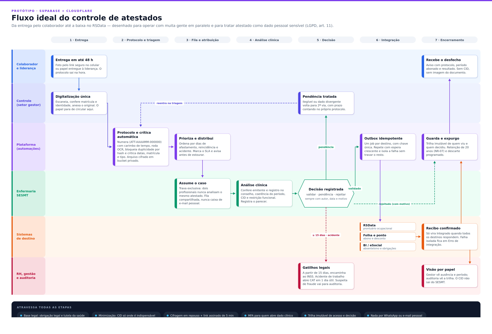
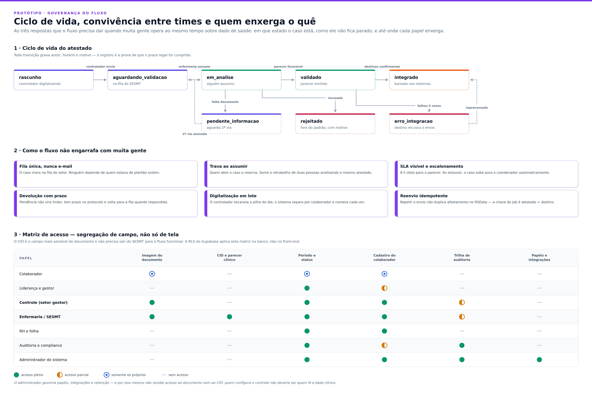

# Fluxo ideal — controle de atestados





Os PNGs acima são gerados a partir de `diagramas/gerar_diagramas.py` (SVG) e
convertidos com o Chromium headless:

```bash
cd docs/diagramas && ./renderizar.sh      # regera .svg e .png
ESCALA=3 ./renderizar.sh                  # versão para impressão
```

---

## 1. As sete etapas

| # | Etapa | Quem age | O que o sistema garante |
|---|-------|----------|-------------------------|
| 1 | **Entrega** | Colaborador ou liderança | Protocolo emitido no ato — a prova de que o prazo de 48 h foi cumprido é do colaborador, não do papel na gaveta de alguém. |
| 2 | **Protocolo e triagem** | Plataforma | Numeração `ATT-AAAAMM-000000`, OCR, bloqueio de duplicidade por hash do arquivo, crítica de datas/matrícula/tipo, arquivo cifrado em bucket privado. |
| 3 | **Fila e atribuição** | Plataforma → Enfermaria | Fila única do setor, priorizada por dias de afastamento, reincidência e acidente. SLA visível, com alerta antes de estourar. |
| 4 | **Análise clínica** | Enfermaria / SESMT | Conferência de emitente e registro no conselho, coerência do período, CID e restrição funcional. Parecer registrado. |
| 5 | **Decisão** | Enfermaria / SESMT | Validar, devolver como pendência ou rejeitar — sempre com autor, data e motivo. |
| 6 | **Integração** | Plataforma → sistemas | Outbox com um job por destino, chave `atestado + destino`, repetição com espera crescente. Falha em um destino não trava os demais. |
| 7 | **Encerramento** | Plataforma | Confirmação ao colaborador sem dado clínico, trilha imutável, retenção e expurgo programados. |

## 2. Por que o fluxo aguenta muita gente ao mesmo tempo

- **Fila única, nunca caixa de e-mail.** O caso mora no setor, não na pessoa que estava de plantão.
- **Trava ao assumir.** Quem abre o caso o reserva; some o retrabalho de duas pessoas analisando o mesmo atestado.
- **SLA com escalonamento.** 8 h úteis para o parecer; ao estourar, sobe para o coordenador.
- **Devolução com prazo.** Pendência não vira limbo: tem prazo no protocolo e volta para a fila quando respondida.
- **Digitalização em lote.** O controlador escaneia a pilha do dia e o sistema separa por colaborador.
- **Reenvio idempotente.** Repetir o envio não duplica afastamento no RSData.

## 3. Tratamento do dado sensível

Atestado é dado pessoal sensível (LGPD, art. 5º, II; tratamento pelo art. 11, II, "a" e "c" —
cumprimento de obrigação legal e tutela da saúde). O desenho parte de duas decisões:

1. **O CID não precisa sair do SESMT para o fluxo funcionar.** RH, gestor e folha precisam do
   período e do status; nada além disso. A segregação é de campo, aplicada na RLS do Postgres —
   não é filtro de tela.
2. **Todo acesso vira evento.** Inclusive a leitura que não muda o estado do atestado. A trilha é
   o que sustenta uma eventual apuração de vazamento.

Controles que atravessam todas as etapas:

| Controle | Implementação no protótipo |
|----------|----------------------------|
| Base legal registrada | `configuracoes` + aviso de privacidade na tela de envio |
| Minimização | CID exposto só a `admin` e `enfermaria` (política de RLS) |
| Cifragem em repouso | Bucket privado do Supabase Storage, sem URL pública |
| Acesso ao documento | URL assinada de curta duração, gerada por requisição |
| Autenticação reforçada | MFA obrigatório para quem abre dado clínico |
| Trilha imutável | `atestado_eventos`, apenas `insert` para os usuários |
| Retenção | 20 anos (NR-07 / eSocial), com expurgo programado |
| Canal | Nada trafega por WhatsApp ou e-mail pessoal |

## 4. Estados do registro

```
rascunho ─▶ aguardando_validacao ─▶ em_analise ─▶ validado ─▶ integrado
                    ▲                    │            │           │
                    └── pendente_informacao           │           ▼
                                         └─▶ rejeitado└──▶ erro_integracao ──┐
                                                              ▲              │
                                                              └── reprocessa ┘
```

Toda transição é feita por RPC no banco (`assumir_atestado`, `validar_atestado`,
`rejeitar_atestado`, `solicitar_informacao`), nunca por `update` direto do front-end —
é o que impede dois usuários de decidirem o mesmo caso e garante o registro do autor.
